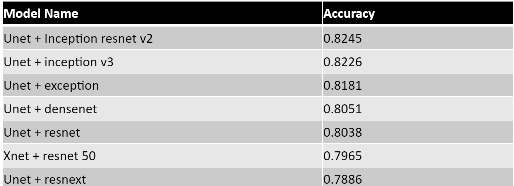
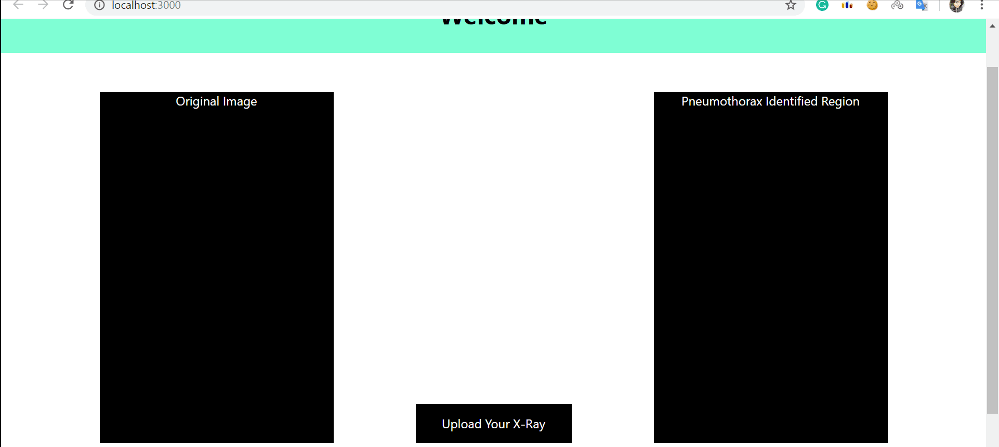

# A quick walkthrough from Kaggle Competition to a working POC 

4 months ago I and my office teammate completed [**SIIM-ACR Pneumothorax Segmentation**](https://www.kaggle.com/c/siim-acr-pneumothorax-segmentation) challenge and then we made a working demo project with the models we built for the competitions. The competition was to detect Pneumothorax(Air in the Lungs) and identify Pneumothorax affected regions (pixels) of an X-Ray image.

This competition was our first competition in computer vision. Also, we never worked on computer vision before in any other way. So to get along with the competition I was studying the fundamentals of CV, looking into other people's notebook and reading papers to understand and fix what should we try to solve the problem. We listed model architectures to try in the competition. Initially, we listed backbones for unet and tried them one by one. We also picked a starter notebook from kaggle and tried out our backbones on that. 

We tried Image Augmentations:
- Horizontal Flip
- Vertical Flip

Results of different Backbones (Epochs: 100 and Batch Size: 8, input Pixels(225, 225))

As Inception Resnet v2 Performed the best so we decided to work on that notebook to make it better. We tried different batch and epoch sizes but that didn't change the result significantly. So, We changed the input size to (512, 512) as the given images were in high resolution(1024, 1024). New Input size boosted a bit but obviously that was not enough. And after doing some Paper Studies on "Image Color Formates" we did the color conversion from RGB to YUV and RGB to HSV and HSV had the best result and the result changed significantly this time. We ended up with a final score of 0.8567 (Public score). And in the final result, our position was in the top 8% with a bronze medal.

After, Finishing the contest we used our best model for our POC project. The backend of the project was done with Django and in Front End React. It was a tiny POC where a user can drop an X-ray image and it shows the affected area marked red if there is pneumothorax.

Here is a demo of the POC

